# Importar una base de datos MySQL Dump]

Se va ha usar el SQLDump de una [base de datos de musica](https://github.com/lefunal/cursoBaseDeDatos/blob/master/ejercicios/4-peliculas/peliculasDump.sql):

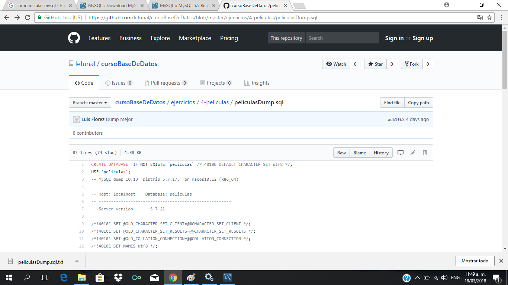
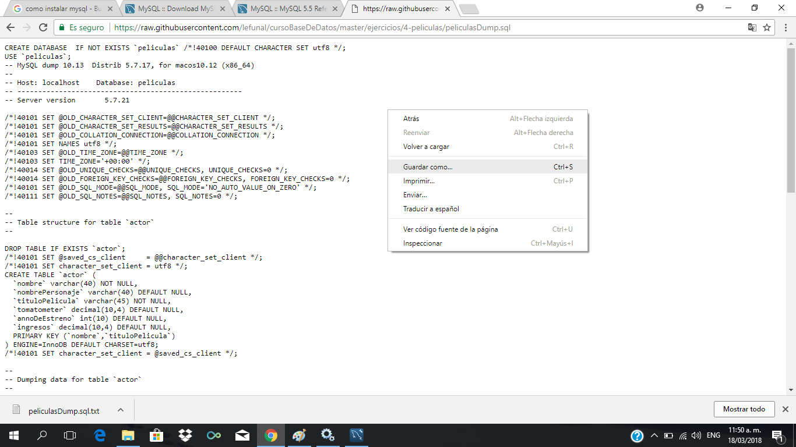

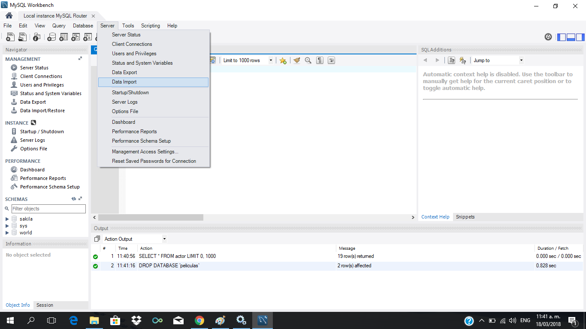
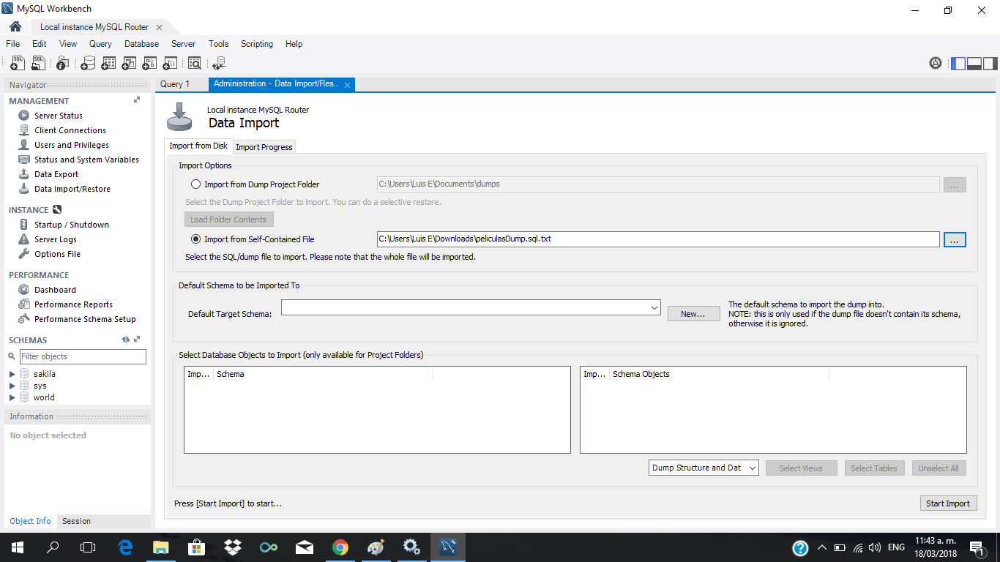
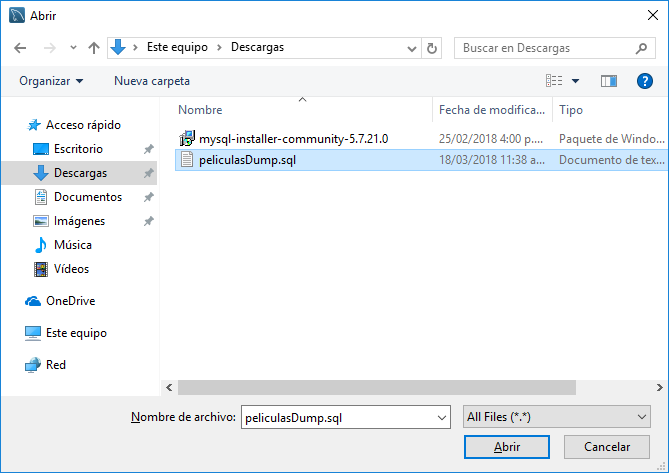
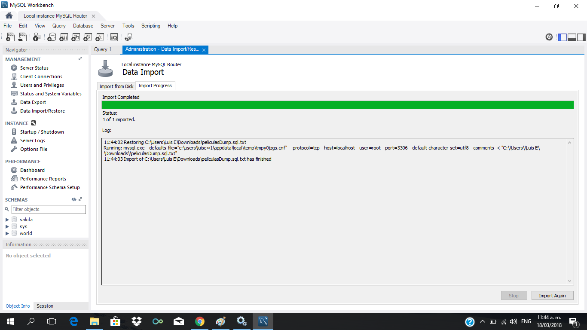
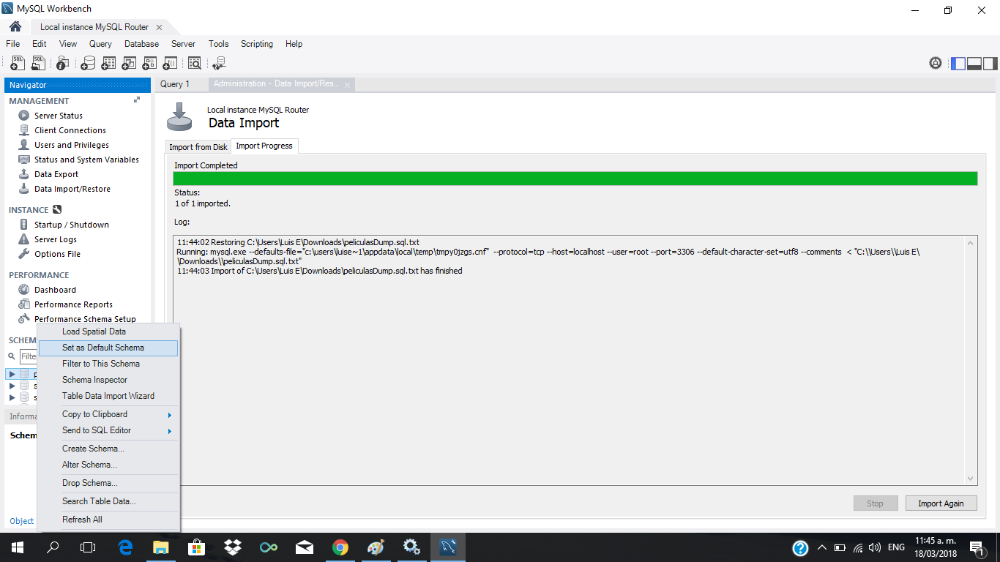
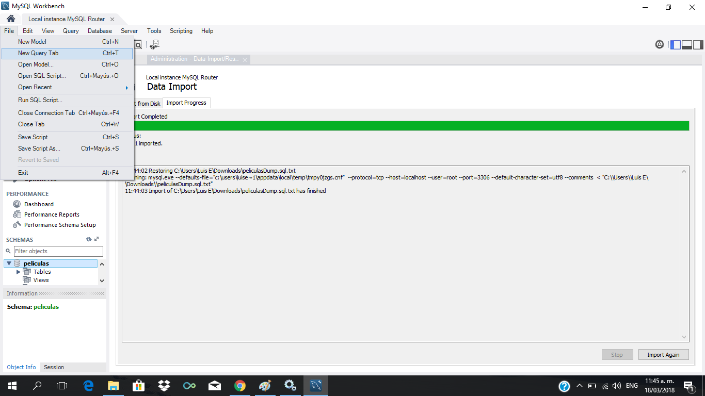
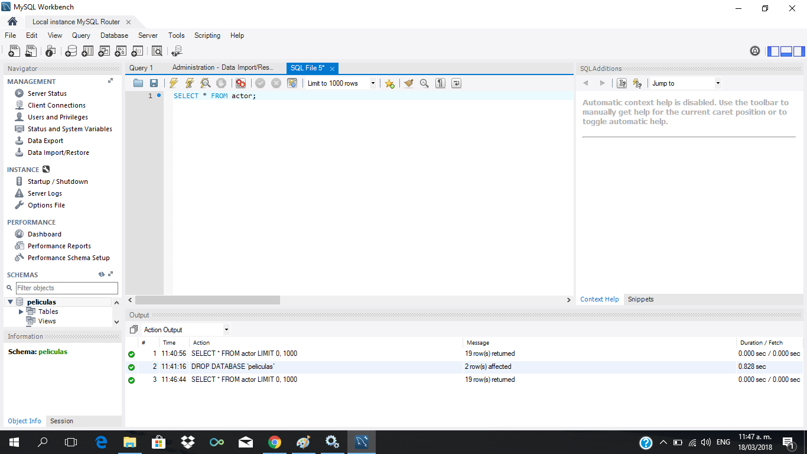
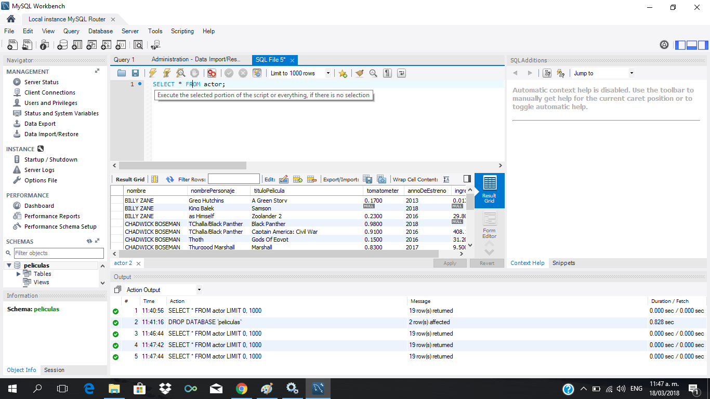
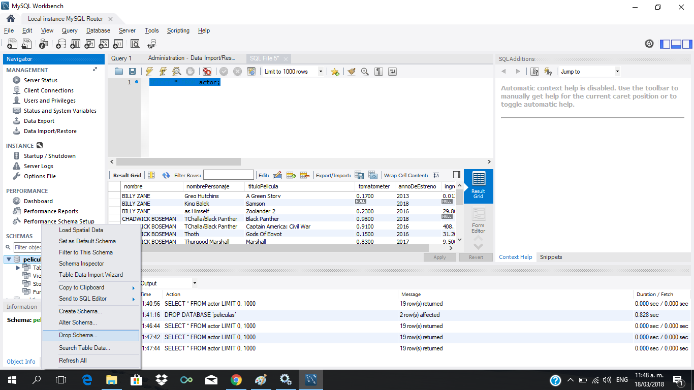

 
