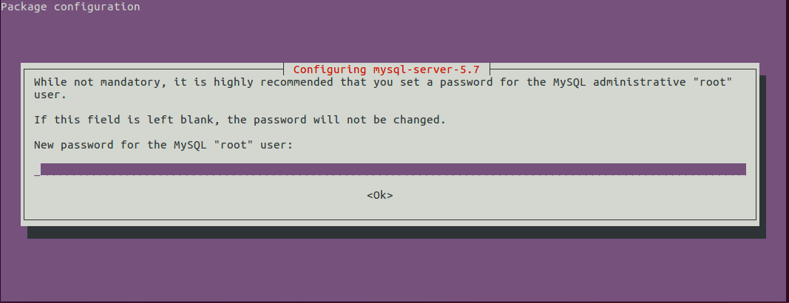

# Instalacion en Ubuntu Linux
En el terminal

    sudo apt-get update
    sudo apt-get install mysql-server

El instalador solicitara una clave que se usara despues para poder logearse a MySQL

Luego para instalar MySQL workbench

    sudo apt-get install mysql-workbench

Fuente: [https://askubuntu.com/questions/174138/how-to-install-mysql](https://askubuntu.com/questions/174138/how-to-install-mysql)

## Cambiar la clave de MySQL
En el terminal ingresar a MySQL:

    mysql -u root -p
   
    ALTER USER 'root'@'localhost' IDENTIFIED BY 'MyNewPass';

Fuente: [https://dev.mysql.com/doc/refman/5.7/en/resetting-permissions.html](https://dev.mysql.com/doc/refman/5.7/en/resetting-permissions.html)

