# Instalacion Windows

## Descargar instalador

[Descragas MySQL 5.7](https://dev.mysql.com/downloads/windows/installer/5.7.html)
El que dice: (mysql-installer-community-5.7.21.0.msi)

## Instalacion

Hacer doble click sobre el instalador:

En general se deben escoger los valores por defecto que ofrece el instalador, el instalador instala MySQL y MySQL workbench (una interfaz grafica).

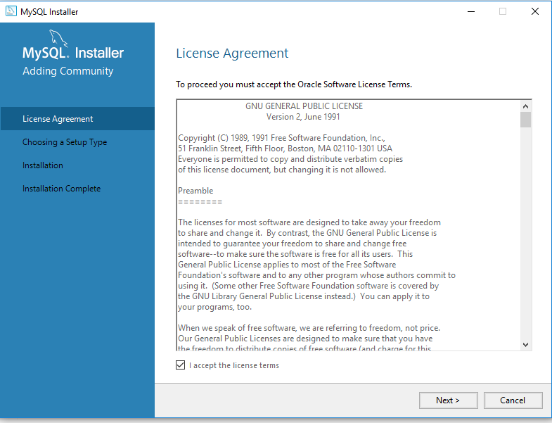
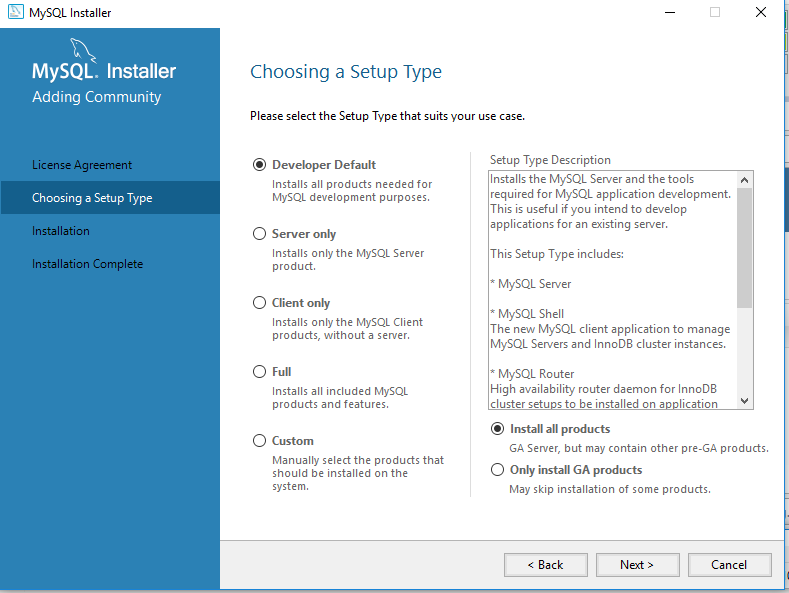
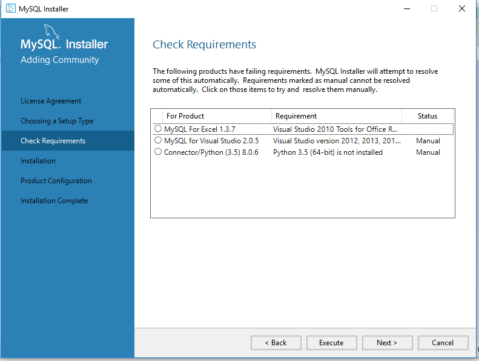
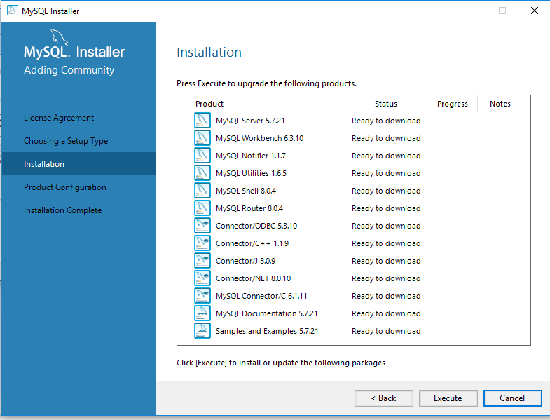
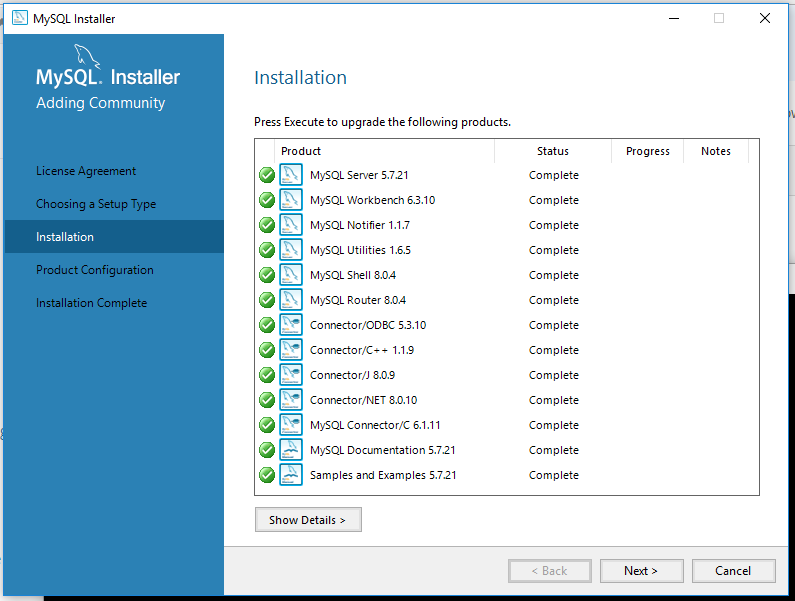
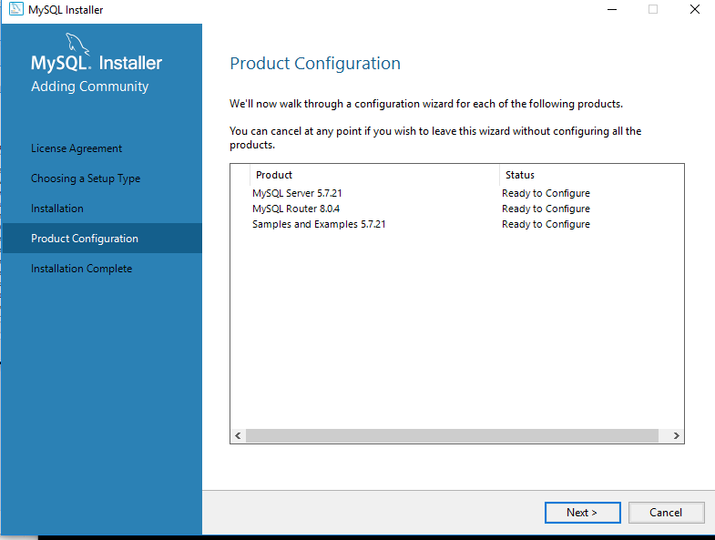
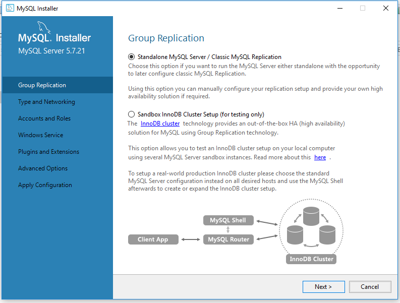
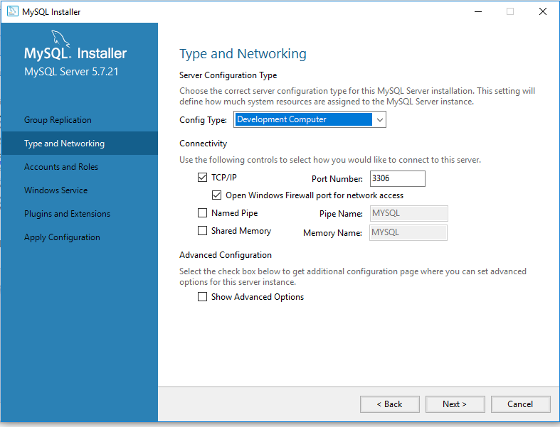
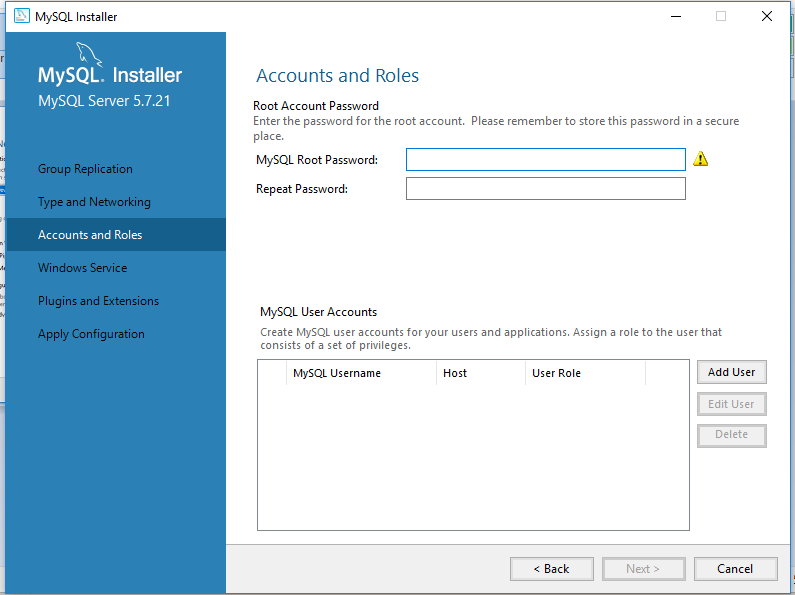
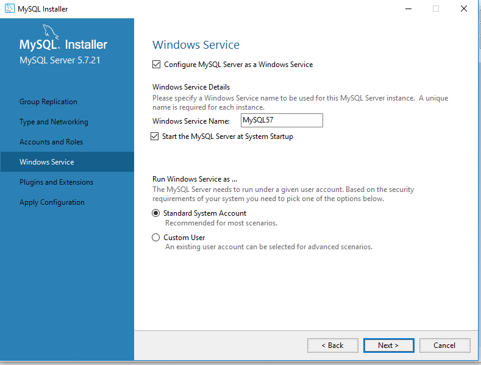
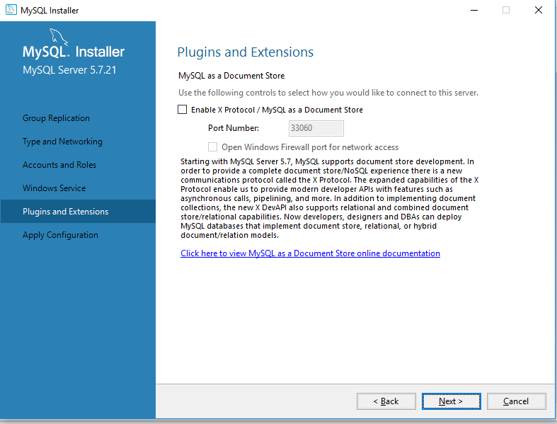
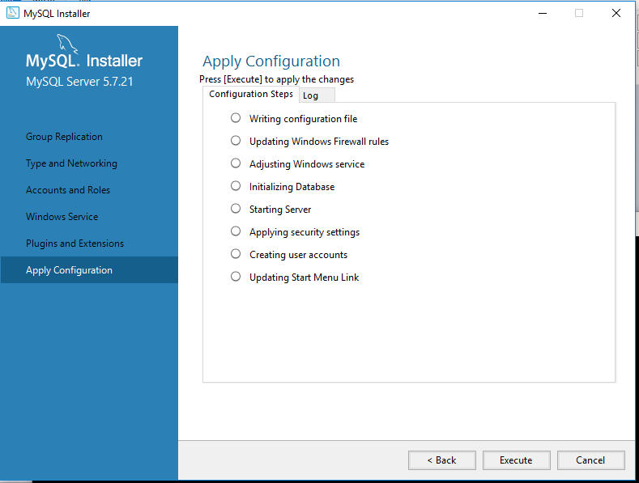
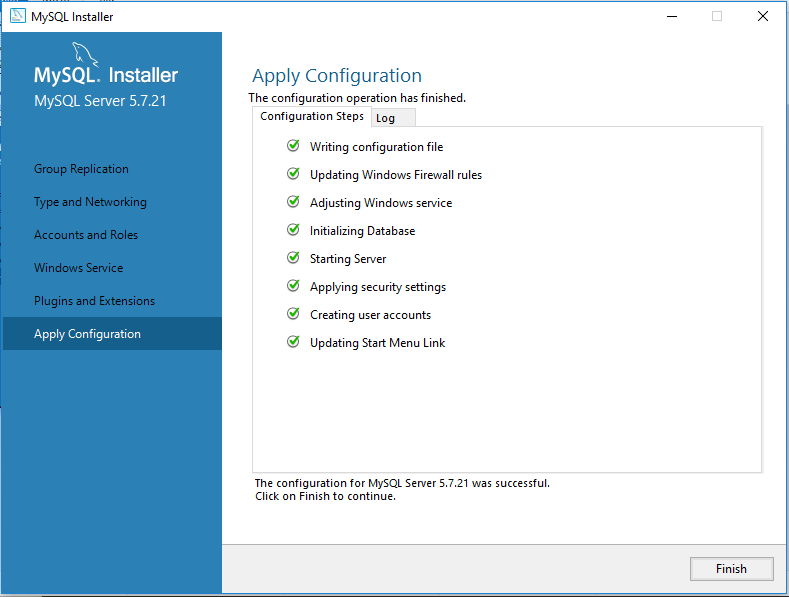
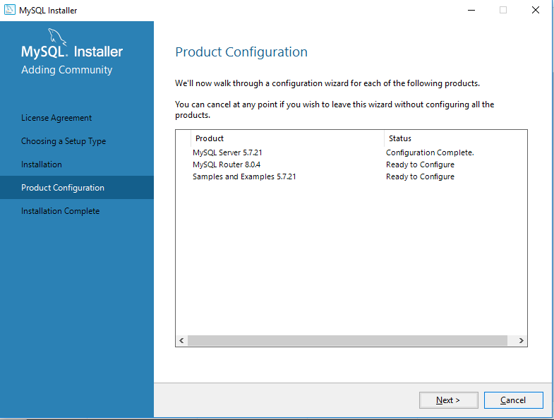
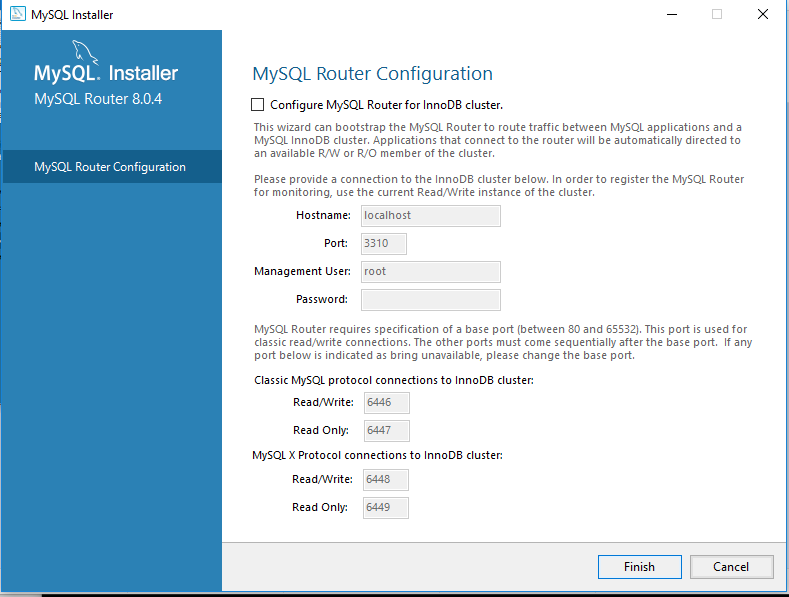
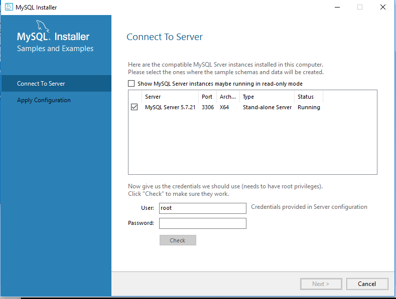
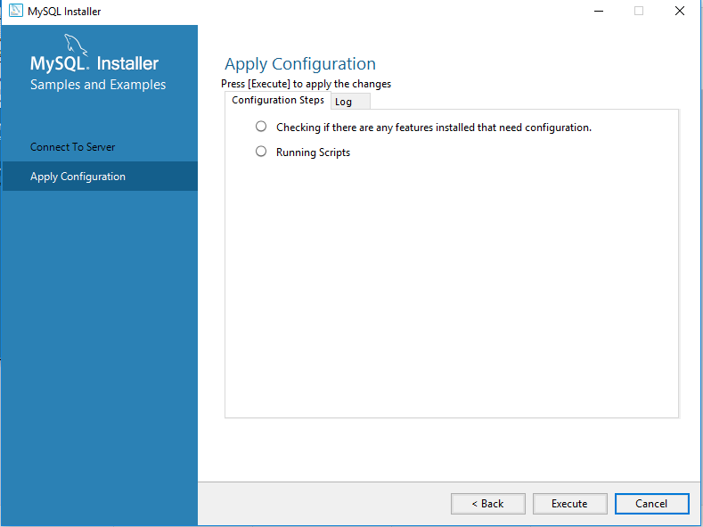
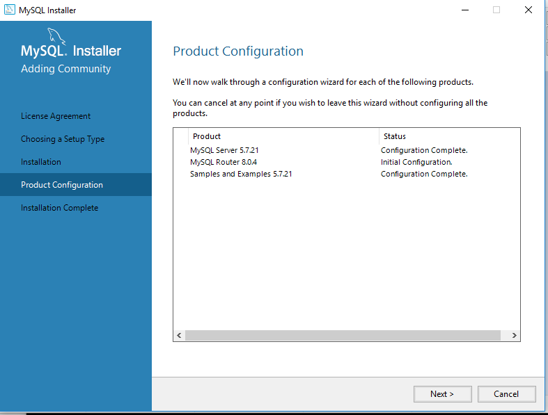
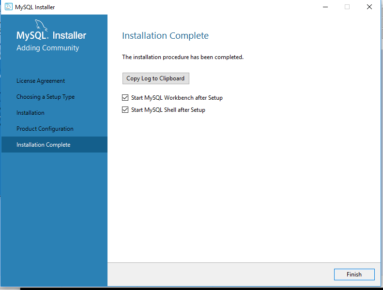

