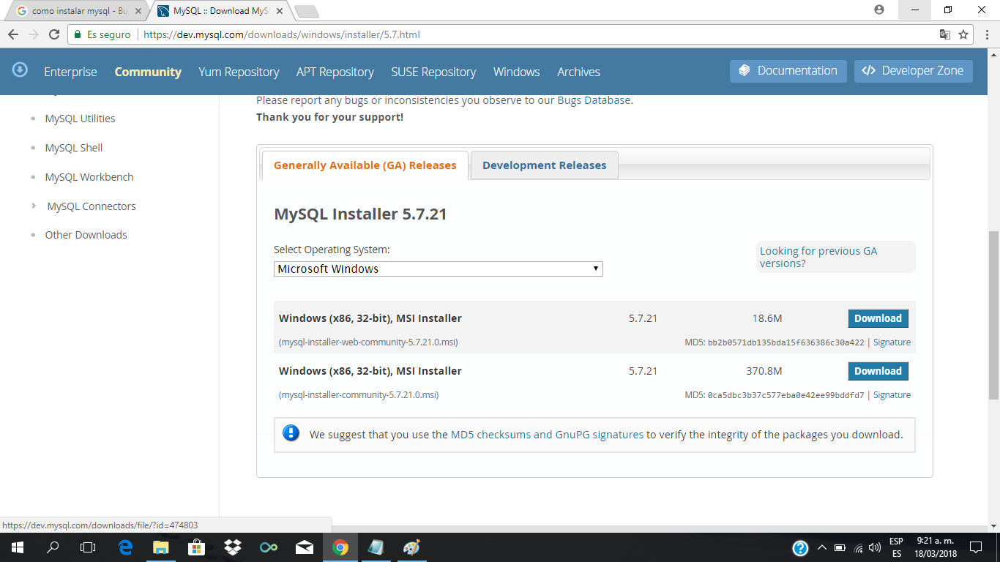
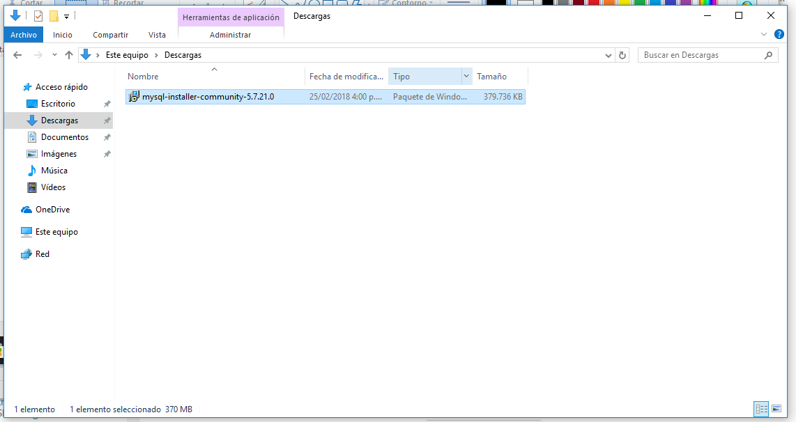

# Instalacion Windows

## Descargar instalador

[Descragas MySQL 5.7](https://dev.mysql.com/downloads/windows/installer/5.7.html)
Es el que dice: (mysql-installer-community-5.7.21.0.msi)

Hacer doble click sobre el instalador:

