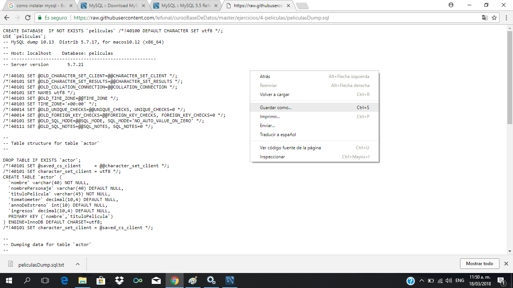
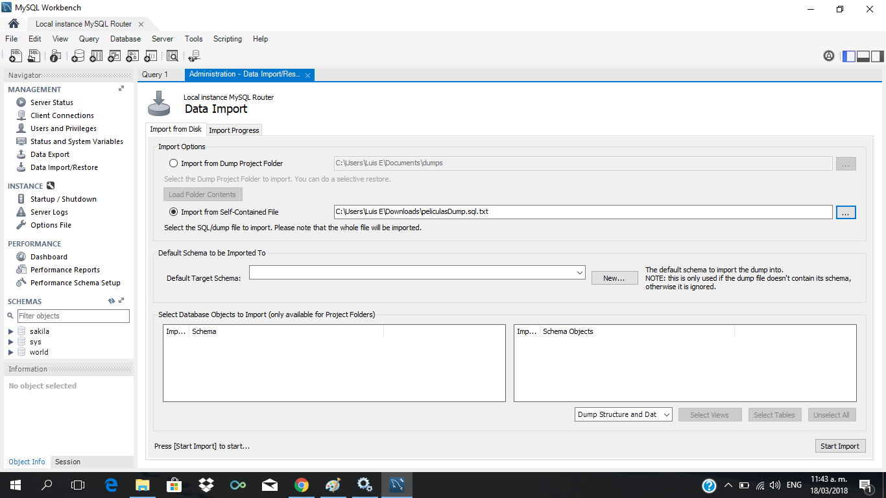
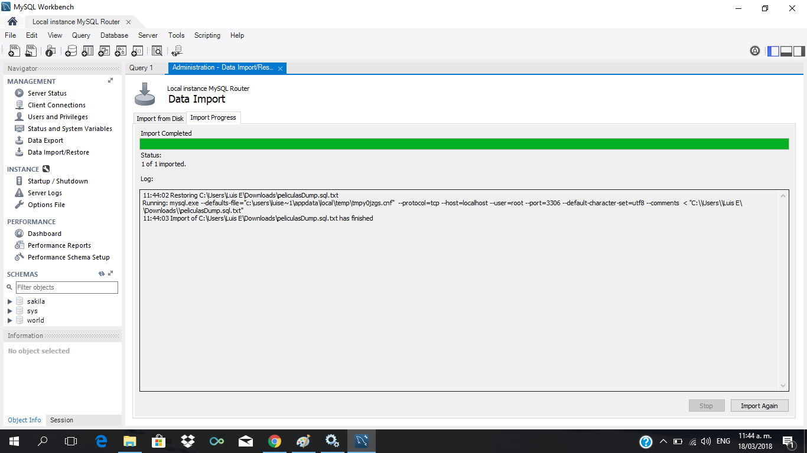
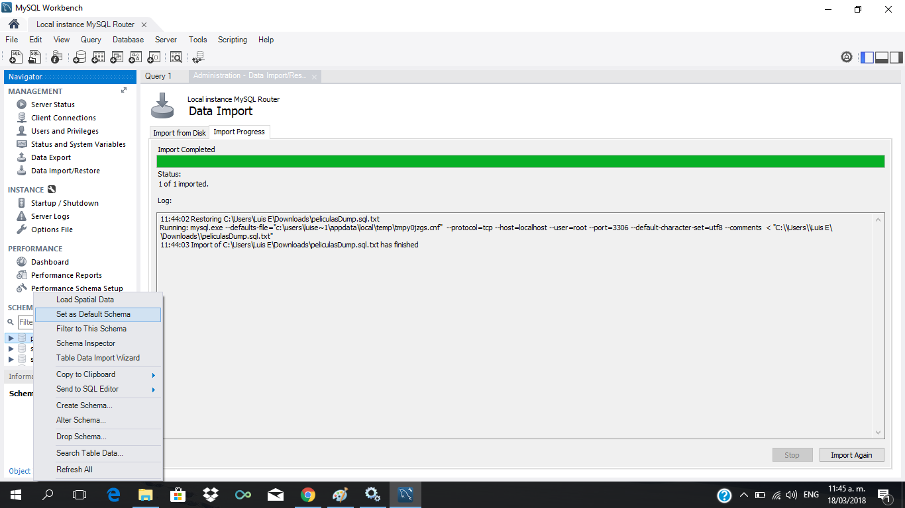
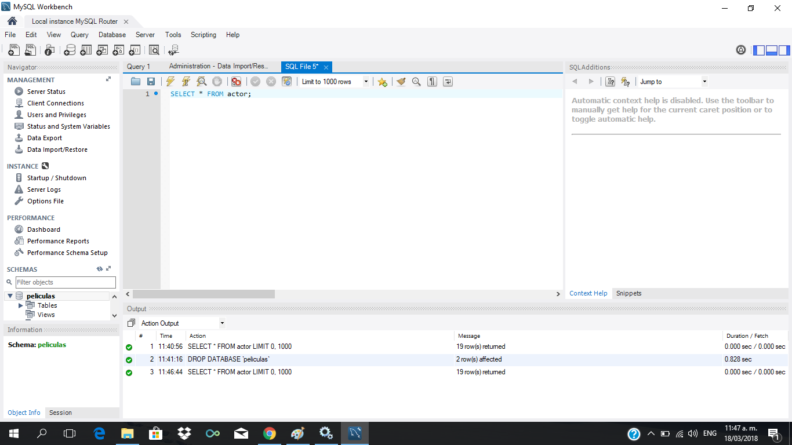
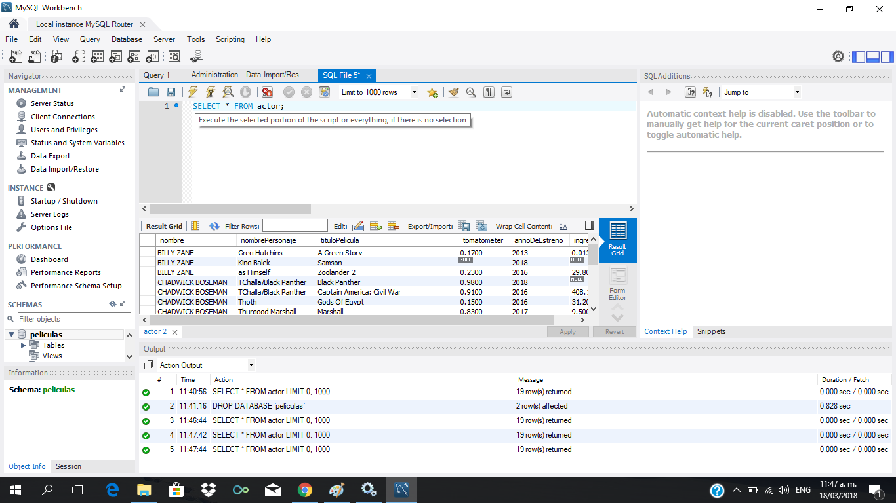
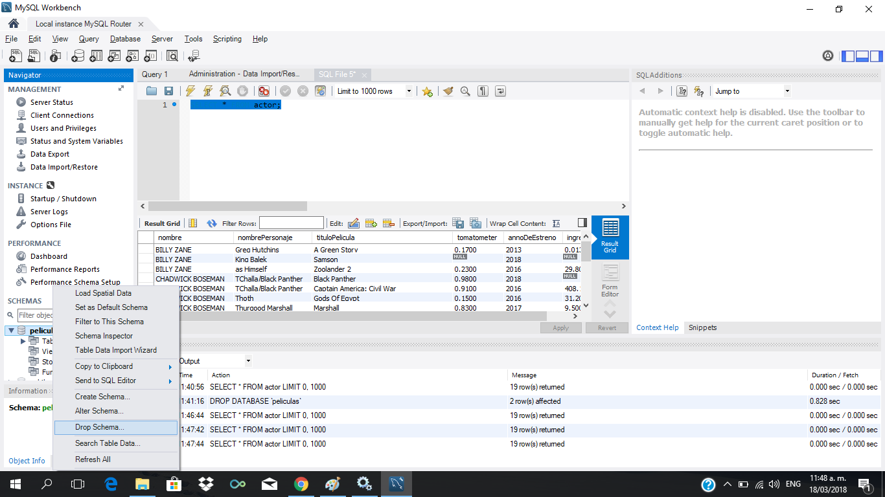
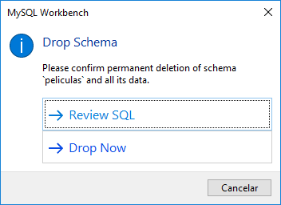

# Importar una base de datos con MySQL Dump

Se va ha usar el SQLDump de una [base de datos de musica](https://raw.githubusercontent.com/lefunal/cursoBaseDeDatos/master/ejercicios/4-peliculas/peliculasDump.sql):

Descargarla en un archivo

## Luego desde Workbench

Importar la base de datos

Refrescar los Schemas (Son las bases de datos) con "Refresh All" y luego hacer que el nuevo Schema sea el de por defecto con "Set as default Schema"

Abrir una nueva tab para coorer sonsultas/commandos SQL

Los comandos se corren con el simbolo de Rayo

Para borrar la base de datos

 
