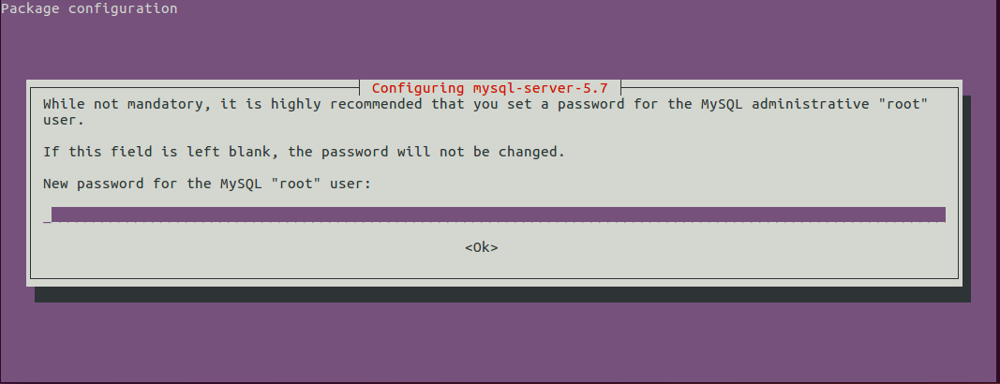

# Instalacion en Ubuntu Linux
En el terminal

    sudo apt-get update
    sudo apt-get install mysql-server

El instalador solicitara una clave que se usara despues para poder logearse a MySQL

Luego para instalar MySQL workbench

    sudo apt-get install mysql-workbench

Fuente: [https://askubuntu.com/questions/174138/how-to-install-mysql](https://askubuntu.com/questions/174138/how-to-install-mysql)

## Cambiar la clave de MySQL
En el terminal:

    /etc/init.d/mysql stop
    sudo mkdir /var/run/mysqld; sudo chown mysql /var/run/mysqld
    sudo mysqld_safe --skip-grant-tables --skip-networking&

En otro terminal:

    mysql -u root
    FLUSH PRIVILEGES;
    SET PASSWORD FOR 'root'@'localhost' = PASSWORD('root');
    FLUSH PRIVILEGES;

En el primer terminal:

    # Kill processes that are mysql from first terminal
    ps aux | grep mysql
    sudo kill -9 <id>

    /etc/init.d/mysql start

Fuentes: 
[https://askubuntu.com/questions/766900/mysql-doesnt-ask-for-root-password-when-installing/766908#766908](https://askubuntu.com/questions/766900/mysql-doesnt-ask-for-root-password-when-installing/766908#766908)

[https://dev.mysql.com/doc/refman/5.7/en/resetting-permissions.html](https://dev.mysql.com/doc/refman/5.7/en/resetting-permissions.html)

