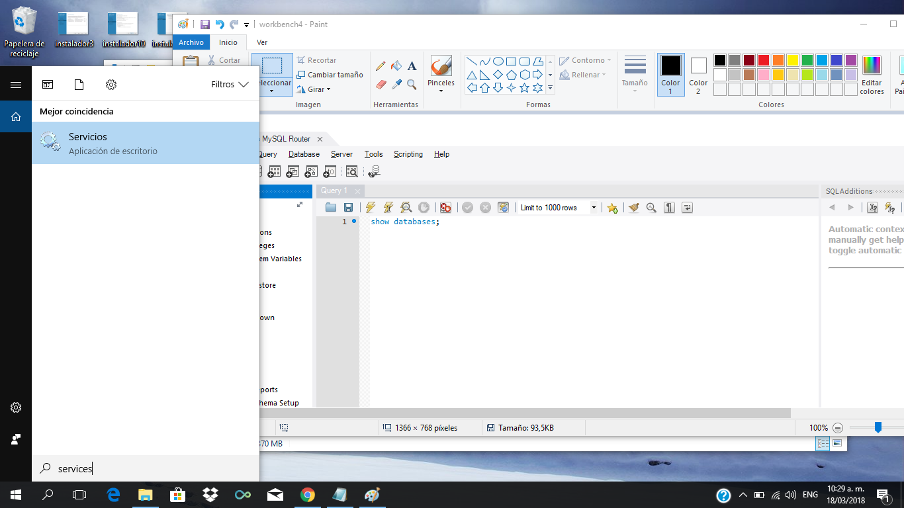
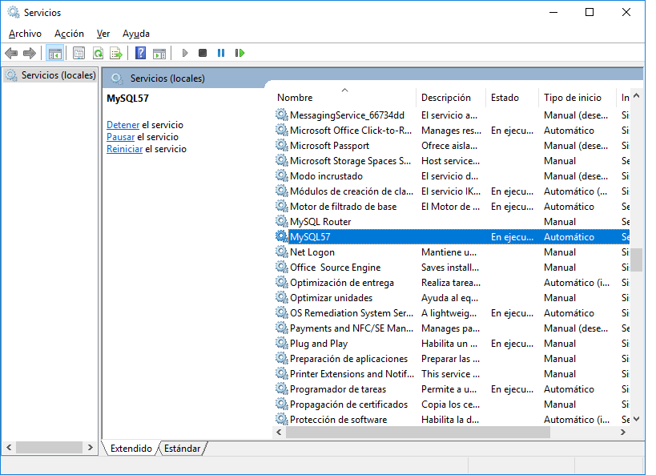
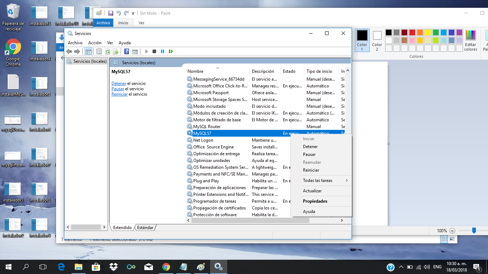
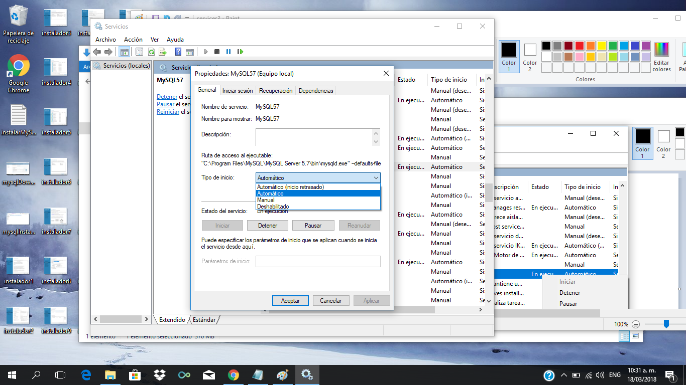

# Configurar el servicio de MySQL windows (opcional)

MySQL puede correr como un servicio en Windows, para interactuar con el servicio (reiniciar el servicio, pararlo, o configurar la forma en que incicia) ir a servicios:

